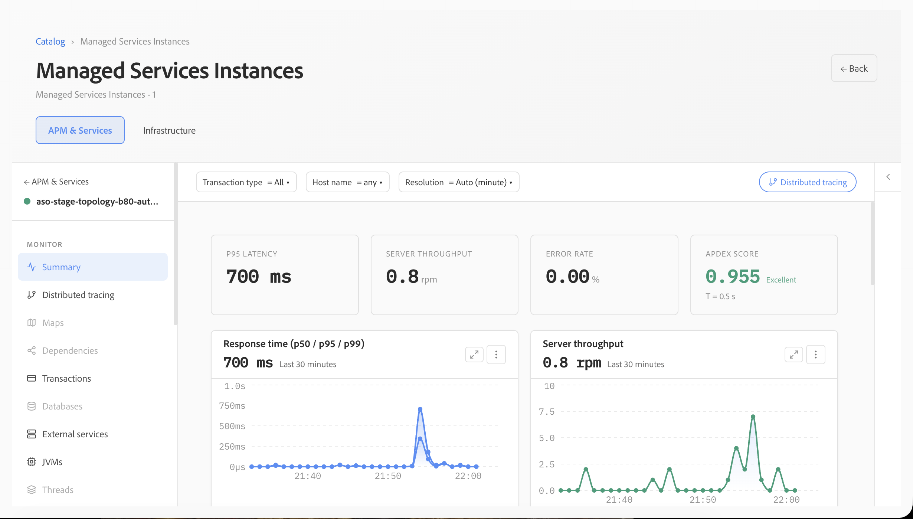

# Aplicativos

Os aplicativos oferecem recursos de APM (Application Performance Monitoring, monitoramento do desempenho dos aplicativos), oferecendo uma visão unificada da integridade, do desempenho, das transações e da infraestrutura subjacente que dá suporte a cada serviço. Ele ajuda as equipes de operações e engenharia a entender o comportamento dos aplicativos, identificar gargalos de desempenho e mudar de indicadores de integridade de alto nível para transações individuais para uma investigação mais profunda.

## Resumo do aplicativo

O resumo de **aplicativos** fornece uma visão geral do aplicativo selecionado. Indicadores-chave como latência p95, taxa de transferência do servidor, taxa de erro e Apdex facilitam a avaliação da integridade do aplicativo durante o intervalo de tempo selecionado.

Os filtros para tipo de transação, host e resolução permitem que a exibição seja refinada para uma investigação específica. As tendências de tempo de resposta e taxa de transferência fornecem contexto adicional, ajudando as equipes a distinguir picos isolados de alterações sustentadas de desempenho.

## Tempo de resposta, taxa de transferência e Apdex

O desempenho do aplicativo pode ser avaliado usando o percentil dos tempos de resposta ao lado da taxa de transferência da solicitação. Visualizar a latência p50, p95 e p99 juntas ajuda a distinguir as experiências típicas do usuário de outliers mais lentos.

O Apdex fornece uma medida complementar da capacidade de resposta do aplicativo, traduzindo o desempenho do tempo de resposta em uma pontuação de satisfação fácil de entender. Juntamente com a taxa de erro, essas métricas fornecem uma indicação concisa sobre se um aplicativo está funcionando dentro dos níveis de desempenho esperados.

## Erros e transações lentas

Os aplicativos exibem continuamente tendências de taxa de erro e transações lentas para ajudar a identificar solicitações que possam estar afetando o desempenho dos aplicativos. A visualização da taxa de erro facilita o reconhecimento de alterações ao longo do tempo, enquanto a tendência do Apdex mostra o impacto correspondente na capacidade de resposta do aplicativo.

A exibição **Transações mais lentas** destaca as transações com a duração média mais alta e inclui o volume de chamadas, facilitando a distinção entre cargas de trabalho executadas com frequência e solicitações lentas isoladas.

## Correlação entre as transações e a infraestrutura

A lista de transações fornece uma exibição focada dos tipos de transações mais lentas, incluindo seu rastreamento observado mais lento, taxa de erro e duração média. Isso ajuda as equipes a identificar rapidamente os padrões de transação que exigem investigação adicional.

Os dados de aplicativos estão correlacionados com os hosts subjacentes, de modo que o desempenho da transação possa ser avaliado juntamente com indicadores de infraestrutura, como tempo de resposta, throughput, utilização de CPU e utilização de memória. Essa correlação ajuda a determinar se um problema de desempenho se origina no processamento de aplicativos ou se pode estar associado à infraestrutura de suporte.

## Análise de desempenho da transação

A visualização de análise de transação classifica as transações por características de desempenho e resume indicadores-chave, como a transação mais demorada, o tempo de resposta p95 mais lento, a taxa de erro mais alta, a taxa de transferência e o Apdex.

As visualizações de série de tempo mostram como as transações mais significativas contribuem para o tempo geral de processamento e como a taxa de transferência da solicitação muda durante o período selecionado. Isso facilita a identificação de endpoints de alto impacto, a comparação do comportamento da transação e a determinação de quais solicitações devem ser investigadas primeiro.

## Investigando problemas de desempenho

Os aplicativos suportam um fluxo de trabalho de investigação progressiva: comece com indicadores de integridade e desempenho no nível do aplicativo, identifique tempos de resposta anormais, erros ou alterações no throughput e, em seguida, restrinja a investigação às transações que mais contribuem para o problema. Os dados de transação podem ser correlacionados com as métricas de infraestrutura no nível do host.

Esse fluxo de trabalho ajuda as equipes a se moverem com eficiência a partir de **integridade do aplicativo → tendência de desempenho → transação → hosts**, reduzindo o tempo necessário para isolar a origem de um problema de desempenho.
