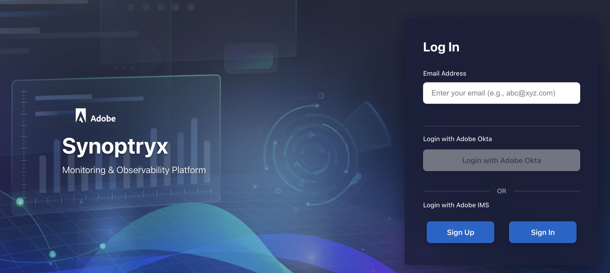

# Monitore seu ambiente AEM Managed Services com o Synoptryx {#synoptryx-monitoring}

O Synoptryx oferece à sua equipe visibilidade sobre o desempenho do aplicativo, a integridade da infraestrutura e a experiência do usuário final — sem configurar uma plataforma de monitoramento separada.

>[!NOTE]
>
> Um informe oficial de visão geral do produto Synoptryx está disponível para a visão geral completa de observabilidade e monitoramento do AEM Managed Services, ideal para compartilhamento com as partes interessadas ou revisão offline.

## Visão geral {#overview}

O Synoptryx é a plataforma de observabilidade de última geração da Adobe, projetada para fornecer visibilidade unificada em termos de desempenho de aplicativos, integridade da infraestrutura e monitoramento sintético. Ele permite o monitoramento pró-ativo de serviços essenciais aos negócios por meio de uma experiência única e integrada. O Synoptryx combina APM (Application Performance Monitoring, monitoramento do desempenho dos aplicativos), monitoramento da infraestrutura e monitoramento sintético da Jornada do usuário para ajudar a identificar e resolver problemas antes que eles afetem os usuários finais. A plataforma oferece rastreamento profundo de transações, insights de JVM, telemetria de infraestrutura e diagnósticos avançados para uma análise mais rápida das causas básicas. Baseado em tecnologias modernas de observabilidade, ele fornece monitoramento escalável e seguro em ambientes corporativos complexos. O Synoptryx oferece retenção de dados estendida, painéis avançados e análise inteligente para oferecer suporte à excelência operacional. A experiência de logon contínua com o Adobe IMS garante acesso e governança seguros. A plataforma foi projetada para melhorar a confiabilidade do serviço, acelerar a solução de problemas e aprimorar a experiência do cliente. Como a solução de observabilidade estratégica da Adobe, o Synoptryx fornece uma base pronta para o futuro para monitoramento, automação e insights operacionais em ambientes de serviços gerenciados.

O Synoptryx está incluído no Adobe Experience Manager Managed Services — não é necessária nenhuma licença ou plataforma de monitoramento separada. A Adobe monitora a disponibilidade e o desempenho de seu ambiente como parte de nossa oferta padrão, e o Synoptryx é a plataforma dedicada que sua equipe pode usar para entender o desempenho de seu aplicativo Adobe Experience Manager (AEM) e de sua infraestrutura de suporte.

Este guia explica o que é monitorado, como sua conta do Synoptryx é configurada e como navegar pelos painéis usados para a análise e solução de problemas diárias.

## Principais características {#at-a-glance}

Como parte do AEM Managed Services, você recebe:

- **Conta dedicada do Synoptryx** — Provisionada e supervisionada pelo Adobe Managed Services, com acesso somente leitura para a sua equipe.
- **Monitoramento profundo de transações do AEM** — o agente APM do Synoptryx rastreia transações significativas até chamadas de método (incluindo números de linha), dependências externas e operações de repositório.
- **Visualização unificada de aplicativo e infraestrutura** — combine métricas de nível de host e APM para otimizar o desempenho de forma holística.

## O que o Adobe monitora com o Synoptryx {#what-we-monitor}

O Adobe monitora as camadas do AEM **Author** e **Publish** com o plug-in Synoptryx APM Java. Todos os servidores hospedados em sua topologia são monitorados com o agente do Synoptryx Infrastructure. O monitoramento personalizado de APM e infraestrutura está habilitado em ambientes Managed Services de produção e não produção.

### Aplicativos em sua conta {#applications-in-your-account}

Sua conta do Synoptryx está vinculada a uma única conta principal do Adobe e pode receber dados de vários aplicativos, incluindo:

- Um aplicativo APM para a camada **Autor** por ambiente Managed Services do AEM
- Um aplicativo APM para a camada **Publicar** por ambiente do AEM Managed Services

Cada aplicativo tem sua própria chave de licença. Todas as topologias em seu contrato do Managed Services são relatadas em uma conta do Synoptryx. Métricas e eventos de APM e Infraestrutura são retidos por até **30 dias**.

## Acessar e sua conta {#access}

Os dados de monitoramento são consolidados em uma conta do Synoptryx que a Adobe provisiona e gerencia. Sua equipe recebe **acesso somente leitura completo** a todas as métricas de APM e Infraestrutura coletadas pelos agentes. O Adobe Managed Services mantém a propriedade e o controle administrativo da conta.

>[!NOTE]
>
> **Obter acesso:** O acesso ao Synoptryx requer o provisionamento do Adobe IMS. Seu CSE (Engenheiro de sucesso do cliente) pode provisionar e gerenciar o acesso de usuários para sua organização.

Depois que o CSE provisionar a conta, você poderá entrar em [synoptryx.adobecqms.net](https://synoptryx.adobecqms.net).

## O que vem a seguir {#whats-next}

Continue com os painéis de monitoramento que sua equipe usa diariamente:

- [Monitoramento de desempenho de aplicativo (APM)](application-performance-monitoring.md) — Rastreie transações do AEM, analise o comportamento do JVM e inspecione serviços externos.
- [Monitoramento de infraestrutura](infrastructure-monitoring.md) — Analise as métricas de sistema, rede, processo e armazenamento no nível do host.
