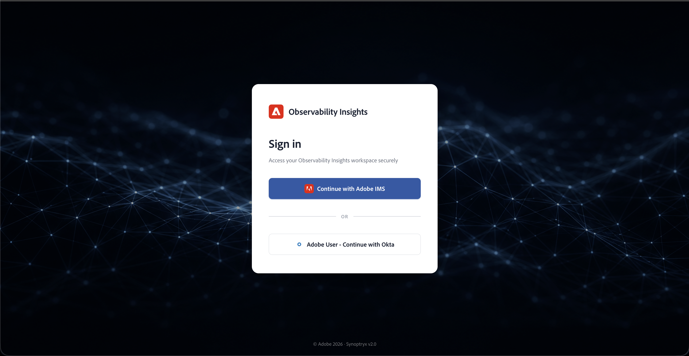

# Monitore seu ambiente do AEM Managed Services com Insights de capacidade de observação {#observability-insights-monitoring}

Os **Insights de capacidade de observação** oferecem visibilidade sobre o desempenho do aplicativo, a integridade da infraestrutura e o comportamento do serviço no AEM Managed Services, sem exigir uma plataforma de monitoramento separada.

Se você for responsável pela confiabilidade do serviço, resposta a incidentes ou análise de desempenho, os **Insights de capacidade de observação** ajudam a passar rapidamente dos sintomas para as evidências. Ele combina telemetria de aplicativos e sinais de integridade no nível do host para que as equipes do cliente e a Adobe possam investigar problemas de uma visualização operacional compartilhada.

## Whitepaper de Insights de Observabilidade

[Baixe o white paper de Insights de observação](v2-assets/Observability_Insights_Overview.pdf)

## Por que as equipes usam os Insights de observação? {#why-teams-use-observability-insights}

Use o Observability Insights para responder a perguntas operacionais, como:

- O problema afeta o Autor, a Publicação ou ambos?
- O problema é causado pelo comportamento do aplicativo, pela pressão dos recursos do host ou por uma combinação dos dois?
- Quais transações, endpoints ou grupos de status explicam o pico em erros ou latência?
- O problema é isolado em um ambiente ou visível em toda a topologia?

Os Insights de capacidade de observação foram projetados para análise operacional de comportamento recente. Ela ajuda a identificar o que mudou, onde mudou e quais sinais são mais relevantes antes do escalonamento ou da ação corretiva.

## Quais insights de observação o ajudam a fazer? {#what-observability-insights-helps-you-do}

Use os Insights de observação para:

- Entenda como os níveis de Autor e Publicação se comportam em tráfego real.
- Correlacione a latência do aplicativo, as taxas de erro e a integridade da JVM com os sinais no nível do host.
- Confirme se um problema está isolado a um ambiente, um nível ou um host.
- Forneça ao Adobe Managed Services e suas equipes internas uma visualização operacional compartilhada durante a investigação.

Os Insights de capacidade de observação estão incluídos no AEM Managed Services. O Adobe provisiona e gerencia a conta, instrumenta ambientes compatíveis e expõe os painéis resultantes para sua equipe como ferramentas operacionais somente leitura.

Como o Adobe gerencia a configuração e a instrumentação da plataforma, você pode se concentrar na investigação e na interpretação em vez de na implantação do agente, na administração da conta ou na montagem do painel.

## Principais características {#at-a-glance}

Como parte do AEM Managed Services, você recebe:

- **Conta dedicada de Insights de Observabilidade** — Provisionada e supervisionada pelo Adobe Managed Services, com acesso somente leitura para sua equipe.
- **Monitoramento profundo de transações do AEM** — o agente APM dos Insights de Observação rastreia transações significativas até chamadas de método (incluindo números de linha), dependências externas e operações de repositório.
- **Visualização de aplicativos e hosts unificados** — combine aplicativos e métricas no nível do host para otimizar o desempenho de forma holística.

## A quem esta documentação se destina {#who-this-documentation-is-for}

Esta documentação foi projetada principalmente para:

- Administradores do AEM Managed Services que precisam de visibilidade dos ambientes monitorados
- Equipes de operações e suporte que lidam com incidentes, análise de tendências e revisão de serviços
- Equipes de engenharia do cliente em parceria com a Adobe Managed Services durante investigações
- Partes interessadas que precisam entender o escopo do monitoramento e as responsabilidades operacionais

## O que o Adobe monitora com insights de observação {#what-we-monitor}

O Adobe monitora os níveis do AEM **Author** e **Publish** com o plug-in do Java APM dos Insights de Observação. Todos os servidores hospedados em sua topologia são monitorados com o agente de Infraestrutura do Observability Insights. O monitoramento personalizado de APM e infraestrutura está habilitado em ambientes Managed Services de produção e não produção.

### Aplicativos em sua conta {#applications-in-your-account}

Sua conta do Observability Insights está vinculada a uma única conta principal do Adobe e pode receber dados de vários aplicativos, incluindo:

- Um aplicativo APM para a camada **Autor** por ambiente Managed Services do AEM
- Um aplicativo APM para a camada **Publicar** por ambiente do AEM Managed Services

Cada aplicativo tem sua própria chave de licença. Todas as topologias no seu relatório de contrato do Managed Services em uma conta do Observability Insights. Métricas e eventos de APM e Infraestrutura são retidos por até **30 dias**.

## Acessar sua conta {#access}

Os dados de monitoramento são consolidados em uma conta de Insights de capacidade de observação que a Adobe provisiona e gerencia. Os usuários clientes recebem **acesso somente leitura** a dados de APM e infraestrutura coletados pelos agentes. O Adobe Managed Services mantém a propriedade da conta e o controle administrativo.

### Pré-requisitos {#access-prerequisites}

Antes de fazer logon, confirme o seguinte:

- Sua organização tem uma assinatura ativa do **AEM Managed Services**. Os Insights de capacidade de observação estão incluídos sem custo adicional.
- O seu engenheiro de sucesso do cliente (CSE) provisionou sua conta do Adobe IMS e concedeu acesso à conta dos Insights de capacidade de observação da sua organização.

>[!NOTE]
>
> **Obter acesso:** O acesso aos Insights de Observabilidade exige o provisionamento do Adobe IMS. Entre em contato com o engenheiro de sucesso do cliente (CSE) para provisionar e gerenciar o acesso de usuários para sua organização.

Depois que o CSE provisionar a conta, entre em [insights.adobecqms.net](https://insights.adobecqms.net). Esse URL é o mesmo para todos os clientes do AEM Managed Services; os ambientes e painéis de sua organização têm como escopo sua conta provisionada.
